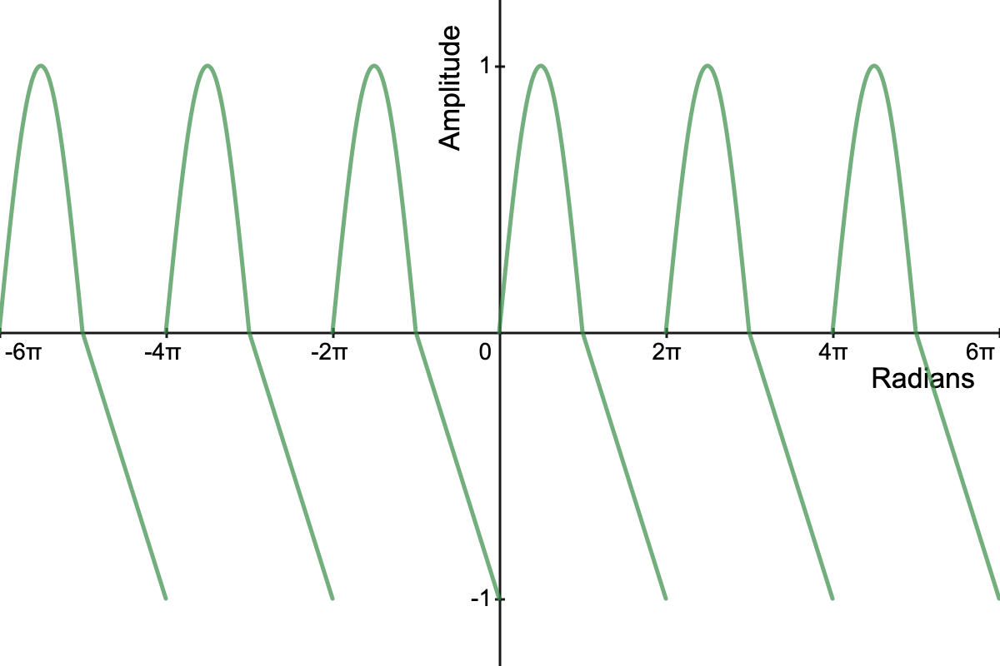

# Creating Your Own Synth Module

**Tutorial Info**

- Author: jeffreyrosenbluth
- Required Knowledge:
    - [Getting Started](/getting_started.md)

---

## Introduction

**Oscen** provides many pre-built synth modules, but eventually you might want
to build your own. In this tutorial we will build 3 synth modules:
1. A Funcky Oscillator
2. A Leaky Integrator (i.e a one pole low-pass filter)
3. A Soft Clipping Module

## Funcky Oscillator

We will build an oscillator that is a sine wave for the first half of it's period
and a sawtooth wave for the second half. This is easier to explain with a picture.



```rust,no_run
 use oscen::signal::*;
 use crate::{as_any_mut, std_signal};

 #[derive(Clone]
 pub struct Funcky {
     tag: Tag,
     hz: In,
     amplitude: In,
     phase: Int,
 }

 impl Funcky {
    pub fn new() -> Self {
        Self {
            tag: mk_tag(),
            hz: 0.into(),
            amplitude: 1.into(),
            phase: 0.into(),
        }
    }

    pub fn hz<T: Into<In>>(&mut self, arg: T) -> &mut Self {
        self.hz = arg.into();
        self
    }

    pub fn amplitude<T: Into<In>>(&mut self, arg: T) -> &mut Self {
        self.amplitude = arg.into();
        self
    }

    pub fn phase<T: Into<In>>(&mut self, arg: T) -> &mut Self {
        self.phase = arg.into();
        self
    }
}

impl Builder for Funcky {} 
```
