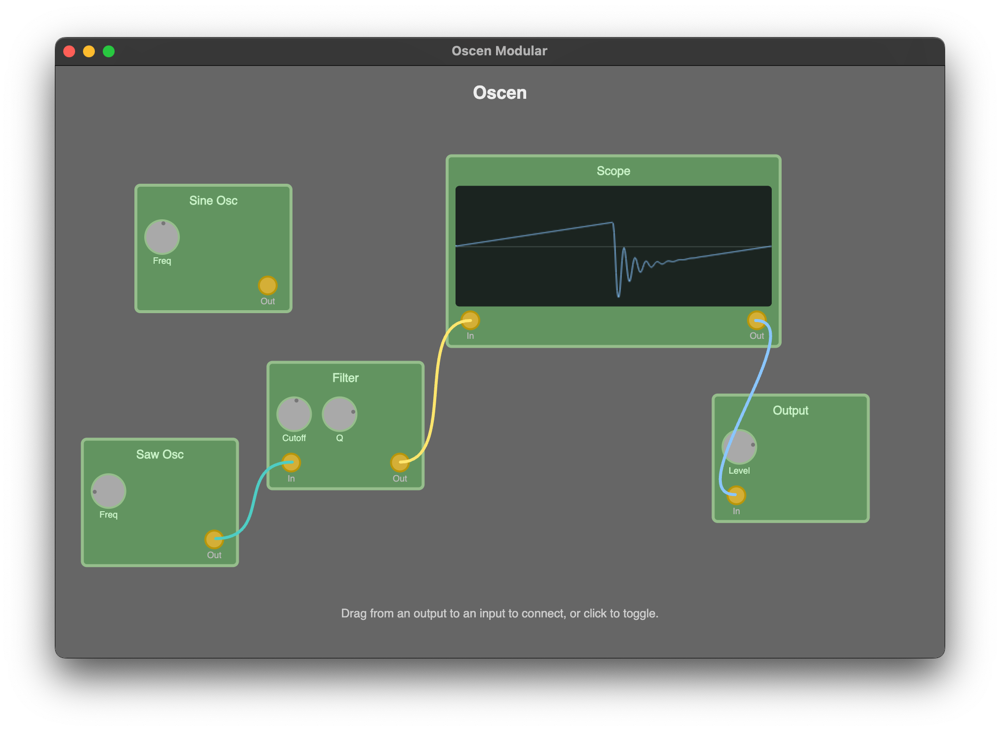

# Modular Synthesizer Example

A visual modular synthesizer built with Oscen and Slint demonstrating real-time graph reconfiguration.



## Architecture

The application consists of three main components:

1. **Audio Thread**: Runs the CPAL audio callback, processes the graph sample-by-sample, and applies messages from the UI
2. **UI Thread**: Runs the Slint GUI, handles user interactions, and sends control messages to audio thread
3. **Oscilloscope Renderer**: Periodically reads waveform data from shared buffer and renders to screen

Connections are managed by mapping UI endpoint IDs to actual `StreamOutput` and `StreamInput` endpoints in the graph.

## Running

```bash
cargo run --package modular
```

## Usage

1. Click and drag from an output jack (right side of a module) to an input jack (left side)
2. Adjust knobs to control oscillator frequencies, filter parameters, and volume
3. Click an output jack to disconnect all cables from it

